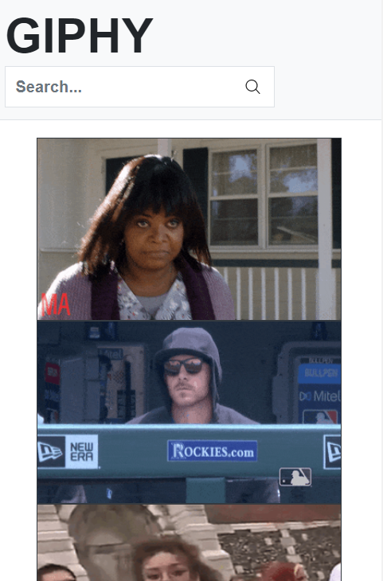
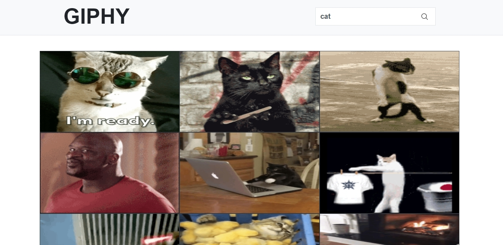

# giphy
[Giphy API](https://developers.giphy.com/) used with React and Bootstrap to create a website where users are able to scroll and see Giphy's gifs based on trending gifs and search filter results.

## Why I picked React + Bootstrap (Reactstrap) And What I've Learned

Pros of the stack:
- React offers VDOM manipulation, making it faster in re-building the layout after a manipulation.
- React offers components for re-usability and organizaiton of features/layouts.
- Bootstrap offers quick layouts and features to manipulate and utilize.

Cons of the Stack:
- The need to use Bootstrap grids for layout is solved by flex and CSS grids.


What I've learned:
- React, Bootstrap.
- Utilizing promises through axios to call APIs.

Cons of the whole project - Things to improve on:
- No minificaiton/uglification/optimization.
- No linters and type checkers used.
- No types of testing.
- PostCSS is not used to detect/use pre-fixes.
- Prop drilling could be utilized.
- API Key is included in the commits. Should be encrypted/hidden next time.


## What It Looks Like



## Getting Started

These instructions will get you a copy of the project up and running on your local machine for development and testing purposes. See deployment for notes on how to deploy the project on a live system.

Clone the project. Use `npm install` to install all the dependencies.

### Prerequisites

What things you need to install the software

```
- Any package manager (npm, yarn)

```

## Versioning

None
